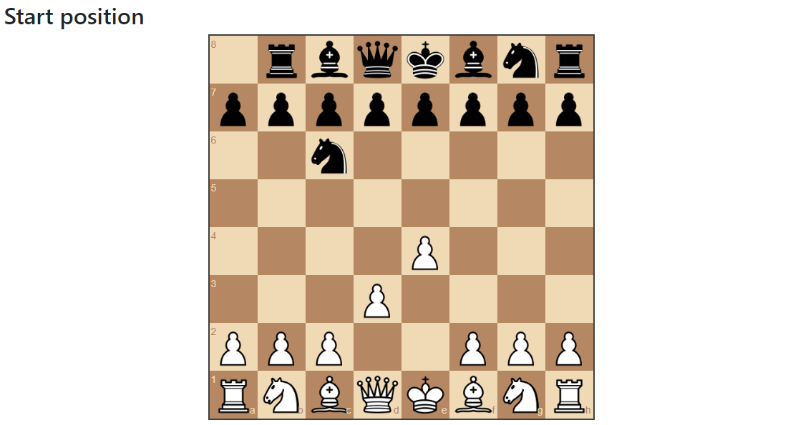
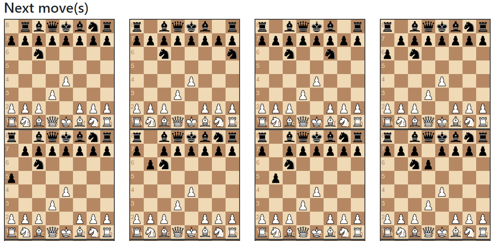

# Simple Chess AI
This is a simple Chess AI, that uses the minimax algorithm(alpha-beta pruning) to evaluate the next few positions. It doesn't learn from played matches or any dataset. If you scroll down you can see the next moves for the AI to choose from. The algorithm isn't perfect but it know's how to capture figures and more. If you have enough computing power make the tree deeper, so the AI becomes smarter. Now have fun play against it!

## About this repo

This repository contains the logic and scripts that combine
three packages:
- [Bootstrap](https://getbootstrap.com/) Build responsive, mobile-first projects on the web with the world’s most popular front-end component library.
- [jQuery](https://github.com/jquery/jquery)  — New Wave JavaScript
- [Chess.js](https://github.com/jhlywa/chess.js) chess.js is a Javascript chess library that is used for chess move generation/validation, piece placement/movement, and check/checkmate/stalemate detection - basically everything but the AI.
- [Chessboard.js](https://github.com/oakmac/chessboardjs) chessboard.js is a JavaScript chessboard component. It depends on jQuery.

## Gallery

Play against the AI:

Look to future positions

### Install

Just download this repo and execute the index.html

### Credits

Credits to [Lauri Hartikka](https://github.com/lhartikk)